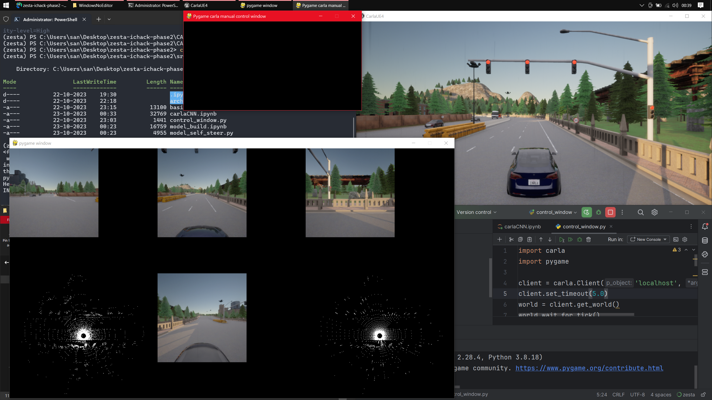

<h1 align='center'>Autonomous Vehicle(AV) Self Driving System</h1>

    

---

#### Technologies/Software/Non-Standard libraries used:

| Technology | Application                           |
| ---------- | ------------                          |
| CARLA      | Vehicle Simulator                     |
| OpenCV     | For data visualization from RGB Camera|
| Keras      | For deep-learning CNN model           |
| Tensorflow | Optimizing the model weights          |
| Pygame     | Manual Control                        |

### CARLA Sensors used:
Virtual senors, videlicet, RGB Camera, LiDAR, Collision Detector

---
### TLDR; [Video Presentation](https://drive.google.com/drive/folders/1te0HDyyQaOI47RANxhuFZEUii8KMuGsd?usp=share_link)